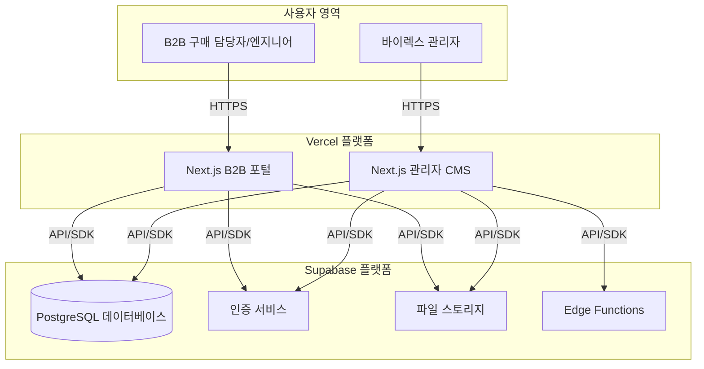

# 기술 요구사항 명세서 (TRD)

## 1. 실행 기술 요약
- **프로젝트 개요**: 본 문서는 주식회사 바이렉스의 B2B 제품 포털 웹사이트 구축을 위한 기술적 요구사항을 정의합니다. Next.js와 Supabase를 기반으로, 2,000개 이상의 제품에 대한 고성능 필터링 및 검색 기능을 제공하고, 비개발자도 쉽게 콘텐츠를 관리할 수 있는 시스템을 구축하는 것을 목표로 합니다.
- **핵심 기술 스택**: 프론트엔드는 Next.js와 Tailwind CSS, 백엔드 및 데이터베이스는 Supabase(PostgreSQL, Auth, Edge Functions)를 사용합니다. 배포는 Vercel을 통해 자동화하여 개발 및 운영 효율성을 극대화합니다.
- **주요 기술 목표**: 95퍼센타일(P95) 기준 2초 이내의 페이지 로딩 속도, 300ms 이내의 API 응답 시간을 달성합니다. 또한, 모듈화된 아키텍처를 통해 유지보수 비용을 절감하고 향후 기능 확장에 유연하게 대응합니다.
- **핵심 기술 가정**: 모든 인프라는 Vercel과 Supabase의 관리형 서비스를 활용하여 서버 관리 부담을 최소화합니다. 초기 제품 데이터는 CSV 형태로 제공되며, 이를 기반으로 데이터베이스 스키마를 설계합니다.

## 2. 기술 스택

| 범주 | 기술 / 라이브러리 | 선정 사유 (본 프로젝트에 적합한 이유) |
| --- | --- | --- |
| 프레임워크 | Next.js (App Router) | 서버 사이드 렌더링(SSR)과 정적 사이트 생성(SSG)을 지원하여 초기 로딩 성능과 검색엔진 최적화(SEO) 요구사항을 동시에 충족합니다. Vercel 배포에 최적화되어 있습니다. |
| 데이터베이스 & 백엔드 | Supabase | PostgreSQL DB, 인증, 스토리지, Edge Function을 통합 제공하는 BaaS(Backend as a Service)로, 별도 백엔드 서버 구축 없이 빠르게 개발이 가능합니다. RLS(Row Level Security)로 안전한 데이터 접근 제어를 구현합니다. |
| UI & 스타일링 | Tailwind CSS | 유틸리티 우선 접근 방식으로 신속하고 일관된 반응형 UI를 구축할 수 있습니다. 커스텀 디자인 시스템 구현이 용이하여 브랜드 정체성을 유지하기에 적합합니다. |
| 상태 관리 | Zustand | Redux 대비 코드량이 적고 사용법이 간단하여 필터 상태 등 클라이언트 사이드 상태를 최소한의 복잡도로 관리할 수 있습니다. |
| 데이터 페칭 | SWR | Next.js 개발사인 Vercel에서 제작한 라이브러리로, 캐싱, 재검증, 포커스 추적 등 데이터 동기화를 자동으로 처리하여 사용자 경험을 향상시킵니다. |
| 배포 & 인프라 | Vercel | Next.js에 최적화된 배포 플랫폼으로, GitHub 연동을 통해 CI/CD 파이프라인을 자동으로 구성하고 글로벌 CDN을 기본 제공하여 빠른 콘텐츠 전송을 보장합니다. |
| 관리자 페이지 | Next.js (Custom App) | Supabase의 기본 테이블 편집기 대신, 비개발자 사용성에 초점을 맞춘 별도의 Next.js 애플리케이션을 구축합니다. 직관적인 UI와 CSV 일괄 업로드/검증 기능을 제공하여 운영 효율을 극대화합니다. |

## 3. 시스템 아키텍처 설계

### 최상위 구성 요소
- **Next.js 프론트엔드 애플리케이션**: 사용자가 직접 상호작용하는 웹사이트입니다. Vercel에 배포되며, 제품 목록, 상세 페이지, 문의 양식 등의 UI를 렌더링합니다. 서버 컴포넌트를 활용해 Supabase에서 직접 데이터를 조회하고, 클라이언트 컴포넌트에서 동적 기능을 처리합니다.
- **Supabase 백엔드 서비스**: 올인원 백엔드 플랫폼으로, 다음과 같은 하위 요소로 구성됩니다.
    - **PostgreSQL 데이터베이스**: 제품, 카테고리, 파라미터, 사용자 데이터 등을 저장합니다. 필터링 성능을 위해 주요 조회 컬럼에 인덱스를 적용합니다.
    - **Supabase Auth**: 사용자 인증 및 역할 기반 접근 제어(RBAC)를 관리합니다.
    - **Supabase Storage**: 제품 데이터시트, 이미지 등 정적 파일을 저장하고 CDN을 통해 제공합니다.
    - **Supabase Edge Functions**: 대용량 CSV 파일 처리, 외부 API 연동 등 복잡한 비즈니스 로직을 서버리스 함수로 실행하여 프론트엔드 부담을 줄입니다.
- **커스텀 관리자 CMS**: 비개발자 관리자를 위한 별도의 Next.js 애플리케이션입니다. Supabase API를 호출하여 데이터를 관리하며, 제품 정보의 대량 생성/수정/삭제(CRUD) 기능을 직관적인 UI로 제공합니다.

### 최상위 컴포넌트 상호작용 다이어그램

- **사용자 상호작용**: 일반 사용자는 Next.js로 구축된 B2B 포털에 접속하며, 관리자는 별도로 제공되는 관리자 CMS에 접속합니다.
- **프론트엔드-백엔드 통신**: Next.js 애플리케이션(포털 및 CMS)은 Supabase의 JavaScript SDK를 사용하여 데이터베이스 조회, 파일 관리, 인증 등의 기능을 안전하게 호출합니다.
- **비즈니스 로직 처리**: 대용량 CSV 업로드와 같은 복잡한 작업은 관리자 CMS가 Supabase Edge Function을 호출하여 비동기적으로 처리합니다. 이를 통해 프론트엔드 UI가 멈추는 현상을 방지합니다.

### 코드 구조 및 컨벤션
**도메인 주도 구조화 전략**
- **도메인 분리**: 비즈니스 도메인(제품, 사용자, 주문 등)을 기준으로 코드를 구성하여 응집도를 높이고 결합도를 낮춥니다.
- **계층 기반 아키텍처**: 각 도메인 내부는 `presentation`(UI 컴포넌트), `application`(서비스 로직), `domain`(타입/엔티티)으로 계층을 분리합니다.
- **기능 기반 모듈**: 특정 기능과 관련된 파일(예: 필터링 로직, 컴포넌트, 훅)을 하나의 폴더에 그룹화합니다.
- **공유 컴포넌트**: 여러 도메인에서 공통으로 사용되는 유틸리티, 타입, UI 요소는 `shared` 또는 `lib` 디렉토리에서 관리합니다.

**범용 파일 및 폴더 구조**
```
/
├── src/
│   ├── app/                  # Next.js App Router (페이지 및 레이아웃)
│   │   ├── (admin)/          # 관리자 페이지 그룹
│   │   │   └── dashboard/
│   │   ├── (portal)/         # 사용자 포털 그룹
│   │   │   ├── products/
│   │   │   │   ├── [slug]/page.tsx
│   │   │   │   └── page.tsx
│   │   │   └── layout.tsx
│   │   └── api/              # API 라우트 핸들러
│   ├── components/           # 공유 UI 컴포넌트 (Button, Input 등)
│   ├── domains/              # 핵심 비즈니스 도메인
│   │   ├── product/
│   │   │   ├── components/   # 제품 관련 UI 컴포넌트 (ProductCard, FilterPanel)
│   │   │   ├── services/     # 제품 데이터 처리 로직 (API 호출 등)
│   │   │   └── types/        # 제품 관련 타입 정의 (Product, Parameter)
│   │   └── user/
│   ├── lib/                  # 공유 라이브러리 및 유틸리티 (Supabase 클라이언트 등)
│   ├── styles/               # 전역 스타일
│   └── types/                # 전역 타입 정의
├── public/                   # 정적 에셋 (이미지, 폰트)
└── tailwind.config.ts        # Tailwind CSS 설정
```

### 데이터 흐름 및 통신 패턴
- **클라이언트-서버 통신**: 제품 목록과 같이 동적인 데이터는 Next.js 서버 컴포넌트가 Supabase에서 직접 데이터를 가져와 렌더링합니다. 사용자의 필터링 조작과 같은 상호작용은 클라이언트 컴포넌트에서 SWR을 사용해 API 라우트를 호출하여 비동기적으로 처리합니다.
- **데이터베이스 상호작용**: `supabase-js` 클라이언트를 통해 타입-세이프하게 데이터베이스와 통신합니다. 모든 데이터 접근은 Supabase의 RLS(Row Level Security) 정책을 거쳐 인가된 사용자만 데이터에 접근할 수 있도록 합니다.
- **외부 서비스 연동**: 이메일 발송(SendGrid) 등 외부 서비스 연동은 보안을 위해 서버 측(API Routes 또는 Edge Functions)에서 처리합니다.
- **데이터 동기화**: 제품 필터링 상태는 URL 쿼리 파라미터에 저장하여 사용자가 현재 필터 상태를 북마크하거나 다른 사람에게 공유할 수 있도록 합니다.

## 4. 성능 및 최적화 전략
- **데이터베이스 최적화**: 제품 테이블에서 자주 사용되는 필터링 조건(예: `partnumber`, `series`,